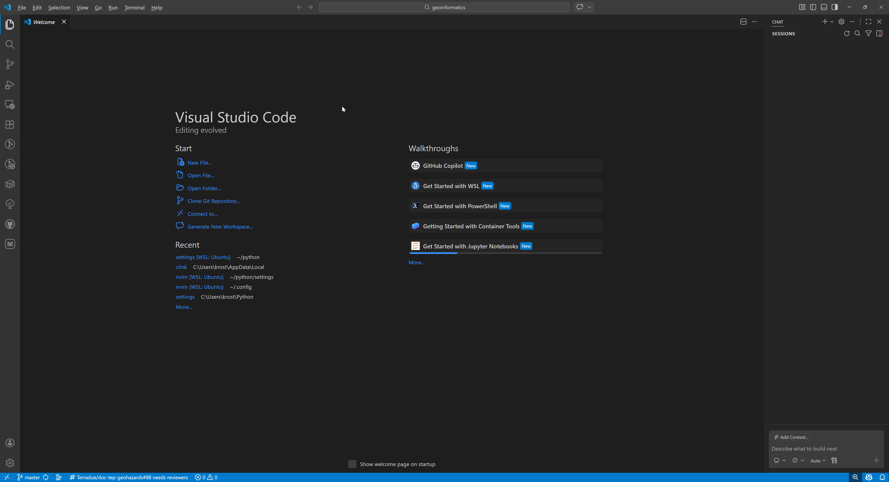
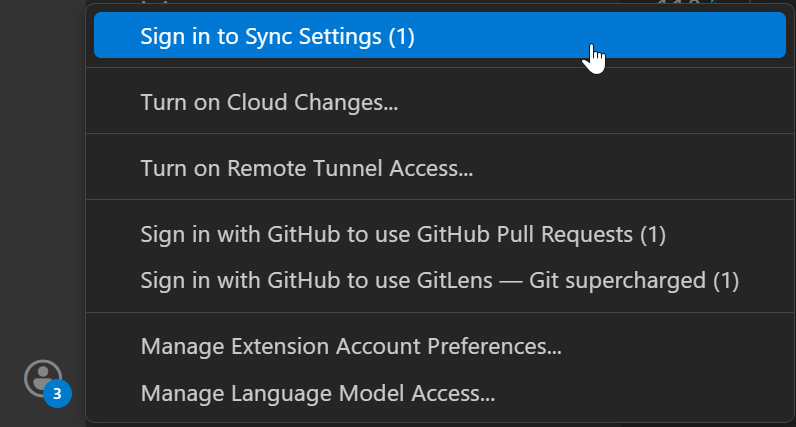
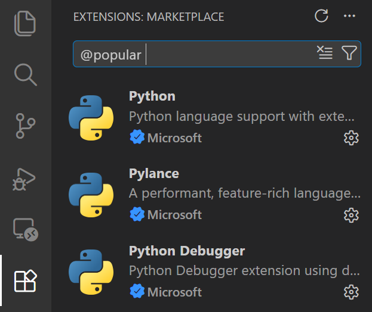
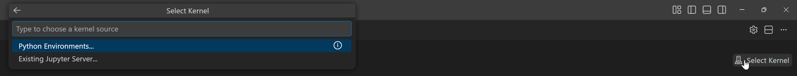
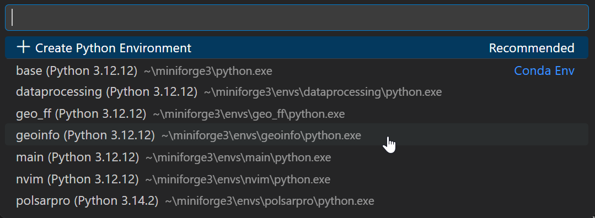
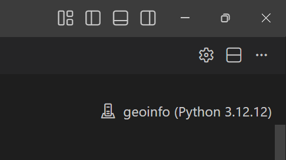
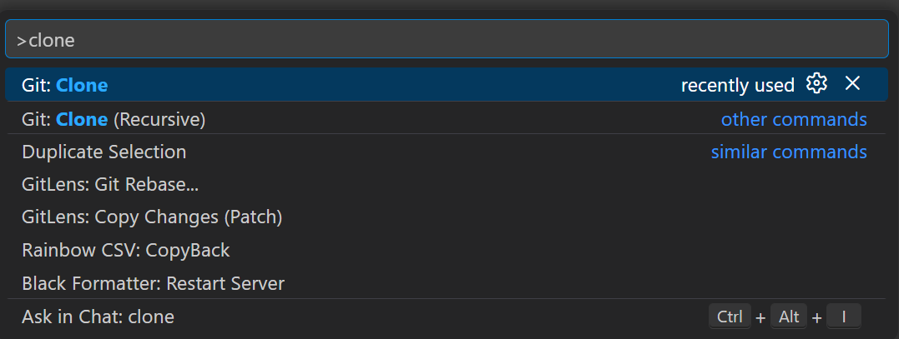
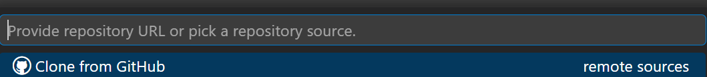

# Geoinformatika III

Vsebina predmeta Geoinformatika III, GIG MA

Krištof Oštir  
Univerza v Ljubljani, Fakulteta za gradbeništvo in geodezijo  
(c) 2026

## Uvod

Za delo pri predmetu Geoinformatika III bomo uporabljali Python in Jupyter Lab. Večino dela bomo opravili v razvojnem okolju Visual Studio Code (VSCode). Če že uporabljate VSCode, ga posodobite na najnovejšo različico. Če ga še nimate, ga namestite z [https://code.visualstudio.com/](https://code.visualstudio.com/). Lahko pa uprabite tudi PyCharm ali katero koli drugo IDE, ki podpira Python in Jupyter Notebooke.

Za delo z različicami bomo uporabljali Git, zato je tudi namestitev Gita del teh navodil. Vse skupaj bomo povezali z delo z GitHubom, zato si pridobite GitHub račun, če ga še nimate. To lahko storite na strani
[sign-up - Overview](https://github.com/SIGN-UP).

Za namestitev potrebnih programov in knjižnic sledite navodilom v tem dokumentu. Navodila so prilagojena za operacijski sistem Windows, vendar so podobna tudi za macOS in Linux.

## Priprava okolja Python

Namestite Python

   * [Anaconda Python 3](https://www.anaconda.com/products/distribution). Lahko za Windows, macOS ali Linux.
   * [Miniconda Python 3](https://docs.conda.io/en/latest/miniconda.html) (manjša različica Anaconde). Če uporabljate Minicondo, lahko ukaz `conda` vedno zamenjate z `mamba`. Mamba je veliko hitrejša alternativa za upravljanje okolij in nameščanje paketov. Mamba je še posebej priporočljiva, če imate veliko paketov ali pogosto posodabljate okolja. Njen privzet kanal je `conda-forge`, ki je zelo zanesljiv in pogosto posodobljen, zato ni potrebe po dodatnem nastavljanju kanalov.

Vedno uporabljajte ukazno vrstico (Windows) ali terminal (macOS/Linux), ki vsebuje condo/mambo, to je `Anaconda Powershell Prompt` ali `Miniforge Prompt`. Preverite namestitev in delovanje Conda/Mamba z naslednjimi ukazi:

```powershell
    conda --version
    conda env list
```

Premaknite se v mapo, kjer je datoteka `environment.yml`, recimo `D:\DELAJTU\PythonInstall`.

```powershell
    cd D:\DELAJTU\PythonInstall
```

Preverite trenutne nastavitve okolij in kanalov.

```powershell
    # conda config --add envs_dirs D:\DELAJTU\PythonEnv
    conda config --show envs_dirs

    # conda config --add channels conda-forge
    # conda config --set channel_priority strict
    conda config --show channels
```

Ustvarite novo okolje z imenom `geoinfo` in namestite Python 3.12. To je priporočljivo, saj omogoča boljšo organizacijo in ločevanje projektov. Vsako okolje lahko vsebuje različne različice paketov, kar je koristno za preprečevanje konfliktov med projekti.

```powershell
    conda env create -f environment.yml
```

Aktivirajte okolje `geoinfo`, da boste lahko uporabljali nameščene pakete in knjižnice. Aktivacija okolja je ključna, saj omogoča, da se ukazi in programi izvajajo znotraj tega okolja, kar zagotavlja, da uporabljate prave različice paketov. Preverite delovanje okolja z zagonom Jupyter Lab:

```powershell
    conda activate geoinfo
    jupyter lab
```

6. Če naletite na težave, posodobite knjižnice v okolju `geoinfo` z naslednjim ukazom, vendar boste s tem dobili okolje, ki ni več enako kot v `environment.yml`. Če želite ohraniti okolje usklajeno z `environment.yml`, uporabite ukaz za posodobitev okolja:

```powershell
    conda activate geoinfo
    conda update --all
```

Če okolje že obstaja in želite samo namestiti manjkajoče knjižnice, uporabite:

```powershell
    conda env update --file environment.yml --prune
```
## Git

Namestite Git z [https://git-scm.com/downloads](https://git-scm.com/downloads). Za Windows uporabnike je najlaže uporabiti z WinGetom:

```powershell
winget install --id Git.Git -e --source winget
```

Po namestitvi lahko preverite delovanje z ukazom `git --version` v terminalu.
Nastavite svoje uporabniško ime in e-poštni naslov, ki bosta uporabljena za vaše Git commite:

```powershell
    git --version
    git config --global user.name "Vaše Ime"
    git config --global user.email "vaš.
```

## Visual Studio Code (VSCode)

☻

Namestite Visual Studio Code z [https://code.visualstudio.com/](https://code.visualstudio.com/). Visual Studio Code je priljubljeno razvojno okolje, ki podpira številne programske jezike, vključno s Python. Omogoča enostavno integracijo z GitHubom in Jupyter Notebooki, podpira pa tudi številne razširitve, ki izboljšajo produktivnost in izkušnjo kodiranja, vključen ima GitHub Copilot Chat, ki vam lahko pomaga pri pisanju kode in reševanju težav.

☻

Prijavite se v VSCode z vašim GitHub računom, da boste lahko sinhronizirali nastavitve in uporabljali GitHub Copilot Chat. To lahko storite tako, da kliknete na ikono računa v spodnjem levem kotu VSCode in izberete "Sign in to GitHub". S tem boste omogočili dostop do vaših GitHub repozitorijev in funkcij, kot je Copilot Chat, ki vam lahko pomaga pri pisanju kode.



Po namestitvi odprite VSCode in namestite naslednje ekstenzije (razširitve):

 * Python
 * Jupyter
 * Prettier - Code formatter
 * GitHub Copilot Chat
 * Code Spell Checker
 * Slovenian - Code Spell Checker
     - Enable Slovenian Spell Checking Dictionary
 * GitLens ali Git Graph (za boljšo vizualizacijo Git repozitorijev)

Preverite delovanje Jupyter Notebookov v VSCode tako, da odprete `GeoPandas.ipynb` ali `Folium - interaktivno kartiranje.ipynb` in izberete okolje `geoinfo` kot kernel.

Kliknite na `Select Kernel`.



Izberite okolje `geoinfo`.



Če vse deluje pravilno, bi morali biti sposobni zagnati celice v Jupyter Notebooku brez napak. Če naletite na težave, preverite, ali je okolje `geoinfo` aktivirano in ali so vse potrebne knjižnice nameščene.



## Kloniranje repozitorija

Repo z vsemi gradivi za predmet Geoinformatika III je shranjen na GitHubu, in sicer na naslovu [GitHub - UL-FGG/geo3-2526: Geoinformatika III 2025/2026](https://github.com/UL-FGG/geo3-2526). Ta repozitorij vsebuje vse potrebne datoteke, vključno z `environment.yml`, Jupyter Notebooki, gradivi za predavanja in vajami.

Za kloniranje repozitorija z GitHubom uporabite naslednji ukaz v terminalu:

```powershell
    cd D:\DELAJTU\Geo3
    git clone https://github.com/UL-FGG/geo3-2526.git
```

Še bolj elegantno pa je to storiti v Visual Studio Code, kjer lahko uporabite vgrajeno funkcionalnost za kloniranje repozitorijev.

Izberite ukazno paleto (`Ctrl+Shift+P` ali `F1`) in vnesite "Git: Clone".



Izberite GitHUb kot vir repozitorija.



Nato vnesite URL repozit☻orija `https://github.com/UL-FGG/geo3-2526.git`.


## GitHub Student Developer Pack

Če ste študent, lahko izkoristite GitHub Student Developer Pack, ki vam omogoča brezplačen dostop do številnih orodij in storitev za razvoj programske opreme. To vključuje brezplačne račune za različne platforme, popuste na programsko opremo in dostop do ekskluzivnih virov za učenje. Za pridobitev GitHub Student Developer Pack obiščite [GitHub Student Developer Pack](https://education.github.com/pack) in sledite navodilom za prijavo s svojim študentskim e-poštnim naslovom.

## Kaj je treba imeti pripravljeno in nameščeno?

- [ ] Python (Anaconda ali Miniconda)
- [ ] Ustvarjeno Conda/Mamba okolje `geoinfo` z vsemi potrebnimi knjižnicami
- [ ] Git
- [ ] GitHub račun
- [ ] Visual Studio Code (VSCode) z nameščenimi razširitvami
